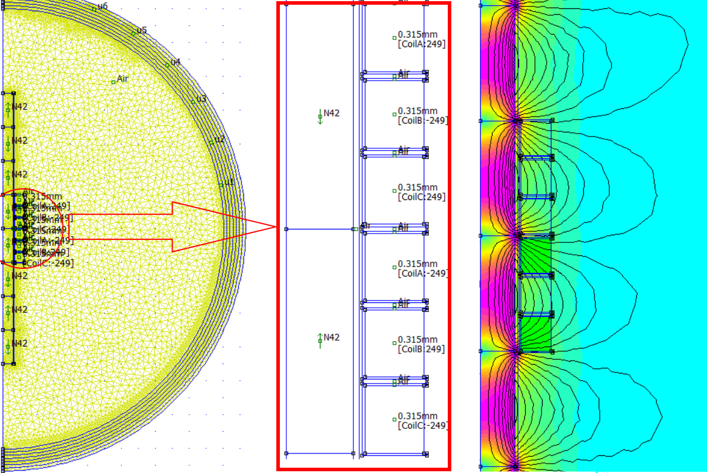
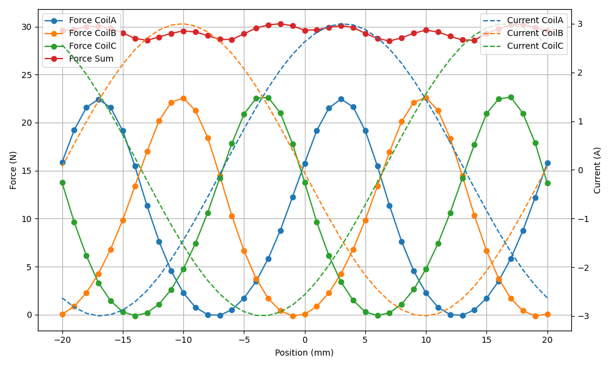

# FEMM Linear Motor Simulations

**Work in progress.**

This project provides a modular Python workflow to automate the simulation of tubular linear motors using [FEMM](http://www.femm.info/wiki/HomePage) (Finite Element Method Magnetics).

Motor design from [cmore839/DIY-Linear-Motor](https://github.com/cmore839/DIY-Linear-Motor).

## Features

- **Parametric model generation** from a YAML configuration file
- **Automated simulation** of force and current accross multiple positions
- **Results export** to CSV and PNG plots
- **Output management**: all results are saved in the `out/` directory

If your coil spool or tube is made of plastic or other non-magnetic material, you can set the following parameters to `0` to skip their generation and speed up the simulation:

- `Spool_ID: 0`  
- `Spool_OD: 0`  
- `Spool_flange_width: 0`  
- `Tube_ID: 0`  
- `Tube_OD: 0`

## Generated Model

An example FEMM model generated from the `Parameters.yml` configuration file:



## Simulation Results: Force vs. Current and Position

This graph shows the resulting force during a linear translation over one pole length, with a step of 1 mm between simulation points:



## Project Structure

```text
FEMM_linear_motor_simulations/
├── create_model.py        # Model builder (geometry, circuits, etc.)
├── femm_model.py          # FEMMModel: handles FEMM file operations
├── motor_dataclasses/
│   ├── coil_dataclass.py      # Coil parameter data class
│   └── magnet_dataclass.py    # Magnet parameter data class
├── Parameters.yml         # Main configuration file (edit this for your motor)
├── README.md              # This file
├── simulation_result.py   # SimulationResult: extracts forces/currents
├── simulate.py            # Main script to run simulations
├── model_builders/        # Geometry creation helpers
│   ├── magnets.py         # Magnet geometry functions
│   │   ├── create_magnet_geometry()   # Draws a single magnet
│   │   ├── add_magnet_block()         # Adds block label and properties
│   │   ├── create_spacer()            # Draws spacer between magnets
│   │   ├── create_tube()              # Draws tube around magnets
│   │   └── create_magnets()           # Orchestrates magnet creation
│   ├── coils.py           # Coil geometry functions
│   │   ├── create_coil_geometry()     # Draws a single coil
│   │   ├── add_coil_block()           # Adds block label and properties
│   │   ├── create_spool()             # Draws spool around coil if needed
│   │   ├── create_coil_spacer()       # Draws spacer between coils if needed
│   │   └── create_coils()             # Orchestrates coil creation
│   └── boundaries.py      # Boundary geometry functions
├── out/                   # All simulation outputs (FEM, CSV, plots)
└── ...
```

### model_builders/

Contains geometry creation helpers for magnets, coils, and boundaries. Each file exposes modular functions:

- `magnets.py`: 
- `create_magnet_geometry`: Draws a single magnet rectangle.
- `add_magnet_block`: Adds block label and sets magnet properties.
- `create_spacer`: Draws a spacer between magnets.
- `create_tube`: Draws tube around magnets if needed.
- `create_magnets`: Orchestrates magnet creation for the motor.
- `coils.py`: 
- `create_coil_geometry`: Draws a single coil rectangle.
- `add_coil_block`: Adds block label and sets coil properties.
- `create_spool`: Draws spool around coil if needed.
- `create_coil_spacer`: Draws spacer between coils if needed.
- `create_coils`: Orchestrates coil creation for the motor.
- `boundaries.py`: Functions for boundary geometry.

## Quick Start

1. **Edit your parameters** in `Parameters.yml` (see example in the file).
2. **Run the main script**:

   ```sh
   python simulate.py
   ```

   This will:
   - Generate the FEMM model from your parameters
   - Run the simulation for all positions
   - Save results in `out/SimulationResults.csv` and plot in `out/Results_Force_Currents.png`

3. **View your results** in the displayed plot and `out/` directory.

## Requirements

- Windows (FEMM is Windows-only)
- Python 3.8+
- FEMM (installed and accessible via Python)
- Python packages: `numpy`, `pandas`, `matplotlib`, `pyyaml`, `pyfemm`

Install dependencies:

```sh
pip install numpy pandas matplotlib pyyaml pyfemm
```

## Customization

- Change simulation parameters (positions, steps, etc.) in `simulate.py`.
- Adjust geometry/materials/current in `Parameters.yml`.
- All output files are written to `out/` (auto-created if missing).

## License

MIT License

---
*Project by Julien (JuPrgn).*
